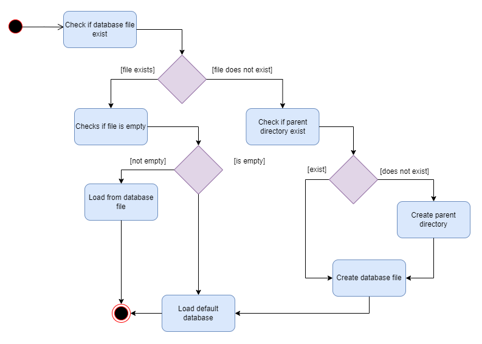
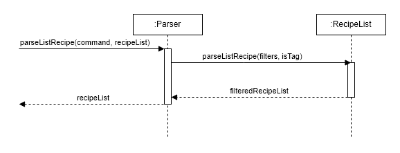

# Developer Guide

* [Acknowledgements](#acknowledgements)
* [Setting up, getting started](#setting-up-getting-started)
* [Design](#design)
    * [Architecture](#architecture)
    * [UI Component](#ui-component)
    * [Parser Component](#parser-component)
    * [Recipe Component](#recipe-component)
    * [RecipeList Component](#recipelist-component)
    * [WeeklyPlan Component](#weeklyplan-component)
    * [Database Component](#database-component)
* [Implementation](#implementation)
    * [Add Recipes Feature](#add-recipes-feature)
    * [Edit Recipes Feature](#edit-recipes-feature)
    * [Categorise/Tag Recipes Feature](#categorisetag-recipes-feature)
    * [List Recipes Feature](#list-recipes-feature)
    * [Delete Recipes Feature](#delete-recipes-feature)

* [Appendix: Requirements](#appendix-requirements)
    * [Product scope](#product-scope)
    * [Target user profile](#target-user-profile)
    * [Value proposition](#value-proposition)
    * [User Stories](#user-stories)
    * [Non-Functional Requirements](#non-functional-requirements)
    * [Glossary](#glossary)

---

## Acknowledgements

{list here sources of all reused/adapted ideas, code, documentation, and third-party libraries --
include links to the original source as well}

---

## Setting up, getting started

---

## Design

* [Architecture](#architecture)
* [UI Component](#ui-component)
* [Parser Component](#parser-component)
* [Recipe Component](#recipe-component)
* [RecipeList Component](#recipelist-component)
* [WeeklyPlan Component](#weeklyplan-component)
* [Database Component](#database-component)

### Architecture

### UI Component
API: `Ui.java`

### Parser Component
API: `Parser.java`

### Recipe Component
API: `Recipe.java`

The `Recipe` component:

* contains `name` and `ingredients` attribute
* store the ingredients details the user has added in `ingredients`

### RecipeList Component

API: `RecipeList.java`

The `RecipeList` component:

* extends from `ArrayList<Recipe>`
* stores the recipes the user has added as `Recipe` objects
* allows users to add their own recipes
* allows users to delete the existing recipes
* allows users to edit the existing recipes
* allows users to view the entire list of recipes
* allows users to view the ingredients required for a recipe
* allows users to tag single or multiple recipes from the recipe list for filtering

### WeeklyPlan Component

API: `WeeklyPlan.java`

The `WeeklyPlan` component:

* extends from `HashMap<String, Integer>`
* stores the names of recipes that the user plans to prepare for the week as `String`
* stores the number of times the user plans to prepare each recipe as `Integer`
* allows users to add single or multiple recipes from the weekly plan
* allows users to delete single, multiple, or all recipes from the weekly plan

How the `WeeklyPlan` component works:

1. When the user enters an input with the first word being `weekly`, the input is passed to
   the `Parser` component.
2. Based on the second argument, the `Parser` component will call the appropriate method in the
   `Parser` component.
3. `Parser` component then returns a `WeeklyPlan` object to indicate the recipe(s) to be added or
   deleted from the weekly plan.
4. `WeeklyPlan` component then uses either `addPlans` or `deletePlans` method to add or delete
   the recipe(s) from the weekly plan.

The sequence diagram below shows how the `WeeklyPlan` component works when the user
inputs `weekly /add burger 1`:

### Database Component

API: `Database.java`

The `Database` component:

* stores the recipes in a local database in json format
* loads up automatically upon startup of program
* saves automatically upon exit of program
* comes with a default database of 10 recipes for new users

How the `Database` component works at start up:

1. Upon starting up the program, the `Database` component will check for the existence of a
   database file in the local directory.
2. If the database file exists, the `Database` component will load the recipes from the database
   file into a `RecipeList` and return this `RecipeList`.
3. If the database file does not exist, the `Database` component will check if the parent directory,
   and create any missing directories and files as necessary.
4. If the database file does not exist or if the file was empty, the `Database` component will
   create a new `RecipeList`
   with 10 default recipes and return this `RecipeList`.

The activity diagram below shows how the `Database` component works at start up:

---

## Implementation
* [Categorise/Tag Recipes Feature](#categorisetag-recipes-feature)
* [List Recipes Feature](#list-recipes-feature)
* [Add Recipes Feature](#add-recipes-feature)
* [Edit Recipes Feature](#edit-recipes-feature)

### Categorise/Tag Recipes Feature

The current implementation:
* add recipes into a tag
* remove recipes from a tag

It is implemented through the following step:
1. When the user enters an input with the first word being `tag`, the input is passed to
   the `Parser` component.
2. In `Parser`, `parseTagRecipe()` is executed to identify whether user want to add recipes 
   to a tag (`<<`), or remove recipes from a tag(`>>`). Then,
   * If user want to add recipes to a tag, `parseAddRecipeTag()` will be executed to extract 
     the all the recipes to be added, separated by `,`. and pass those recipes to `RecipeList` 
     component.
   * If user want to remove recipes from a tag, `parseRemoveRecipeTag()` will be executed to 
     extract the all the recipes to be removed, separated by `,`. and pass those recipes to 
     `RecipeList` component.
3. In `RecipeList`,
   * If user want to add recipes to a tag, `addRecipeToTag()` is executed to add recipes in 
     to the tag.
   * If user want to remove recipes to a tag, `removeRecipeFromTag()` is executed to add recipes 
     in to the tag.

The sequence diagram below shows how this feature works:

### List Recipes Feature

The current implementation:
* list all recipes
* list recipe with filters (name, ingredients, tags)

It is implemented through the following step:
1. When the user enters an input with the first word being `list`, the input is passed to
   the `Parser` component.
2. In `Parser`, `parseListRecipe()` is executed to identify whether user want to filter 
   by tag (`/t`), otherwise the list is filtered by name and ingredients, and whether 
   there are many filters (`&`). All the filters is extracted out and passed to `RecipeList`
   component.
3. In `RecipeList`, `listRecipes()` is executed to filter all recipes that match the filters,
   and return the `recipeList`containing all relevant recipes to `ParserRecipe()`.

The sequence diagram below shows how this feature works:

### Delete Recipes Feature

The current implementation:
* deletes a single recipe by name or recipe's index in recipe list  
* deletes a range of recipes
* deletes all recipes 

It is implemented through the following step:
1. When the user enters an input with the first word being `delete`, the input is passed to
   the `Parser` component.
2. In `Parser`, `parseDeleteRecipe()` is executed to identify whether the user wants to delete all recipes, a single 
   recipe, or range of recipes.
4. In `RecipeList`, `deleteRecipe()` is executed to delete the recipe at whatever index is passed as a parameter,
   and return the `Recipe` object at that index/the one just deleted.

The sequence diagram below shows how this feature works:
{UML will be added here.}

### Add Recipes Feature

The current implementation:
* Add a single recipe in 1 line and followed by all the ingredients in next another line after being prompted.

It is implemented through the following steps:
1. When the user enters an input with the first word being `add`, the input is passed to the `Parser` component.
2. In `Parser`, the `parseAddRecipe` is executed to identify whether the recipe is an already existing recipe or
   it's a new recipe that is being added.
3. After the user enters the ingredients in 1 line, the input is passed to `parseIngredientName` which returns a 
   hashmap<string,integer> with the ingredient name as 'key' and quantity as 'value'.
4. After the recipe name and ingredients are accepted and processed, the input is sent to `recipeList.addRecipe()` 
   to store the new recipe data.

### Edit Recipes Feature

The current implementation:
* There are 3 ways to edit:
   * Edit all ingredients.
   * Edit 1 particular ingredient.
   * Add new ingredient.
  
It is implemented through the following steps:

1. When the user enters an input with the first word being `edit`, the input is passed to the `Parser` component.
2. In `Parser`, the `parseEditRecipe` is executed to identify whether the recipe is an already existing recipe to make edits.
3. The user will then be prompted with 3 options as mentioned above to make edits to the recipe ingredients.
4. After the new ingredients are accepted and processed, the input is sent to `recipeList.editRecipe()`
   to update the new recipe data.

---
## Appendix: Requirements

### Product scope

### Target user profile

* has a need to manage a significant number of recipes
* has a need to manage a significant number of ingredients
* has a need to manage their meal plan on a weekly basis
* can type fast
* prefers typing to mouse input
* is reasonably comfortable using CLI apps

### Value proposition

Allows management of recipes, ingredients and weekly meal plan faster than a typical mouse/GUI
driven app.

### User Stories

| Version | As a ... | I want to ...                                     | So that I can ...                                                 |
|---------|----------|---------------------------------------------------|-------------------------------------------------------------------|
| v1.0    | user     | add my own recipes to the list                    | refer to them when next time                                      |
| v1.0    | user     | edit the existing recipe                          |                                                                   |
| v1.0    | user     | delete a recipe from the list                     | clear the unused recipes                                          |
| v1.0    | user     | view ingredients of the recipe                    | know what is needed to be prepared                                |
| v1.0    | user     | list all recipes I have                           | know what I have some idea of what to cook                        |
| v1.0    | user     | find the recipe that contain specific ingredients | find specific recipe without having to go through the entire list |
| v1.0    | user     | exit from the program                             |                                                                   |
| v2.0    | new user | list all the command that can be used             | know what command I can use                                       |
| v2.0    | user     | add meals I plan to make for the week             | refer to the weekly meals plan next time                          |
| v2.0    | user     | delete meals I plan to make for the week          | remove some meals from the weekly plan if I change my mind        |
| v2.0    | user     | categorise recipes using tags                     | group recipes with similar theme together                         |
| v2.0    | user     | list the recipes by tag                           | list recipes that are under the specific category                 |

### Non-Functional Requirements

{Give non-functional requirements}

### Glossary

* *glossary item* - Definition

### Instructions for manual testing

{Give instructions on how to do a manual product testing e.g., how to load sample data to be used
for testing}